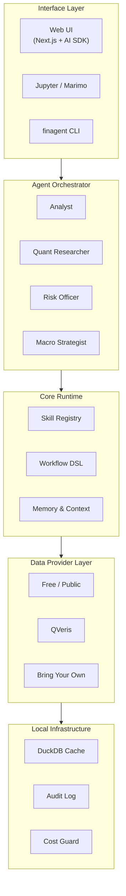

<div align="center">


# OpenFinAgent

**Open-source financial agents — bring your own data, or plug into [QVeris](https://qveris.ai) for instant coverage.**

Compose investment research, due-diligence, and quant workflows with multi-agent teams that route across free public data, your internal feeds, and QVeris's 10,000+ verified capabilities — all behind one SDK, CLI, and Web UI.

[简体中文](./README.zh-CN.md) · [Quickstart](#quickstart) · [Data Providers](./docs/providers/overview.md) · [Roadmap](#roadmap) · [Changelog](./CHANGELOG.md)

[](./LICENSE)
[](https://www.python.org)
[](#roadmap)
[](https://qveris.ai)

</div>

> [!IMPORTANT]
> **OpenFinAgent is in active development (v0.x).** The DataProvider protocol, CLI, and YAML DSL are stabilising but may still change before v1.0. We tag breaking changes in [`CHANGELOG.md`](./CHANGELOG.md). Star the repo to follow along.

<details>
<summary><b>Table of Contents</b></summary>

- [What it looks like](#what-it-looks-like)
- [Quickstart](#quickstart)
- [The Platform at a Glance](#the-platform-at-a-glance)
- [Why OpenFinAgent](#why-openfinagent)
- [Highlights](#highlights)
- [Data Providers](#data-providers)
- [Architecture](#architecture)
- [Examples](#examples)
- [Skills](#skills)
- [Roadmap](#roadmap)
- [Comparison](#comparison)
- [FAQ](#faq)
- [Contributing](#contributing)
- [Security & Compliance](#security--compliance)
- [Community](#community)
- [License](#license)

</details>

---

## What it looks like

One command. Free public data. A finished memo. **No paid keys required** beyond an OpenAI key for the LLM step.

```console
$ finagent run earnings-deep-dive --input ticker=NVDA

╭─────────────────────────────────────────────────╮
│ Running earnings-deep-dive.yaml                 │
│ inputs   = {'ticker': 'NVDA'}                   │
│ providers = ['yfinance', 'sec_edgar']           │
╰─────────────────────────────────────────────────╯
→ fetch  profile…
✓ profile                   0.42s · $0.0000
→ fetch  quote…
✓ quote                     0.31s · $0.0000
→ fetch  filings…
✓ filings                   0.88s · $0.0000
→ agent  thesis…
✓ thesis                    6.10s · $0.0021
→ report report…
✓ report                    0.01s · $0.0000

╭─────────────────────────────────────────────╮
│ done · 7.7s · $0.0021                       │
│ report: reports/NVDA-2026-04-29.md          │
╰─────────────────────────────────────────────╯
```

Every step is **traced, cached, and cost-capped**. The full audit lives in `audit.jsonl` (one JSON line per Discover / Inspect / Call / LLM event), so you can replay or attribute any run later.

---

## Quickstart

> Works today on Python 3.10+. The path below — install, set one env var, run — is what we actually run in CI.

### 1. Install

```bash
# Today (v0.1 preview) — clone and install in editable mode:
git clone https://github.com/Leon-Drq/openfinagent.git
cd openfinagent
pip install -e .

# Once we hit v0.2, this will also work:
# pip install openfinagent
```

### 2. Set your OpenAI key

The `agent` step in the bundled workflow needs one LLM call. Anything OpenAI-compatible works (real OpenAI, Vercel AI Gateway, Azure, local llama.cpp, …).

```bash
cp .env.example .env
# edit .env and fill in:
OPENAI_API_KEY=sk-...
# optional: OPENAI_BASE_URL=https://gateway.ai.vercel.com/v1/openai
```

The two default providers — `yfinance` and `sec_edgar` — need **no API keys**. You can already run a real workflow.

### 3. Run the bundled workflow

```bash
finagent run earnings-deep-dive --input ticker=NVDA
```

You'll see streaming step output, the runner will fetch quote + profile + filings, ask `gpt-4o-mini` to write a memo, and drop the result at `reports/NVDA-<date>.md`. Total wall time on a typical laptop: **5–10 seconds, ~$0.002 in LLM cost**.

### 4. From Python

```python
import asyncio
from finagent import ProviderRegistry, Runner
from finagent.providers.builtin import YFinanceProvider, SecEdgarProvider
from finagent.runtime.llm import LLMClient

async def main():
    registry = ProviderRegistry()
    registry.add(YFinanceProvider(), priority=1)
    registry.add(SecEdgarProvider(), priority=1)

    runner = Runner(registry, llm=LLMClient(), audit_path="audit.jsonl")
    result = await runner.run(
        "workflows/earnings-deep-dive.yaml",
        inputs={"ticker": "NVDA"},
    )
    print(result.report_path, f"${result.total_cost_usd:.4f}")
    await registry.teardown()

asyncio.run(main())
```

A self-contained version of this script lives at [`examples/quickstart.py`](./examples/quickstart.py).

### 5. Plug in QVeris or your own provider

Drop a `config.yaml` next to your workflow (template at [`config.example.yaml`](./config.example.yaml)):

```yaml
providers:
  - { name: yfinance,  type: builtin.yfinance,  priority: 1 }
  - { name: sec_edgar, type: builtin.sec_edgar, priority: 1 }
  - { name: qveris,    type: builtin.qveris,    priority: 2,
      api_key: ${QVERIS_API_KEY}, budget_usd_per_run: 5.00 }
```

Inspect what's loaded:

```bash
finagent providers
```

Bring-your-own providers (Bloomberg, Refinitiv, an internal API) work the same way — write a 50–100 line subclass of [`DataProvider`](./finagent/providers/base.py) and reference it by dotted path under `type:`. Full guide in [`docs/providers/overview.md`](./docs/providers/overview.md).

### 6. Use as an MCP server (Claude Code, Cursor, Codex, …)

The same registry can be exposed as a Model Context Protocol server, so any MCP-compatible client can drive it as if it were a native tool. Three meta-tools are exposed (`discover`, `inspect`, `call`) that mirror the provider protocol; the LLM walks the catalog dynamically without bloating the client's tool list.

```bash
pip install -e ".[mcp]"     # adds the official `mcp` SDK as an extra
```

```jsonc
// ~/.config/Claude/claude_desktop_config.json (or Cursor settings.json)
{
  "mcpServers": {
    "finagent": {
      "command": "finagent",
      "args": ["mcp", "serve"]
    }
  }
}
```

Restart your client and ask it _"discover capabilities for NVDA earnings"_ — it'll route through your free / QVeris / private providers exactly the same way the CLI does.

### What's not in v0.1 yet

`finagent init`, `finagent auth login`, `finagent skill install`, the Web UI, and the `pipx install "openfinagent[ui]"` extra are all on the [roadmap](#roadmap) but not in this release. Star the repo to get notified when they ship.

---

## The Platform at a Glance

<p align="center">
  
</p>

<p align="center"><sub><i>Animated SVG. Open this file in a browser, or view it on GitHub, to see the data flow live and hover the three orchestration stages for details.</i></sub></p>

---

## Why OpenFinAgent

Building a useful financial AI agent today means stitching together dozens of broken pieces — data vendor SDKs, brittle scrapers, hand-rolled tool definitions, no audit trail, no cost ceiling, no way to share your workflow with a teammate.

OpenFinAgent fixes that by standing on three pillars:

1. **A pluggable data layer.** One `DataProvider` protocol covers free public sources, QVeris's 10,000+ verified capabilities, and any private feed you bring. Swap or stack providers via a single YAML — no vendor lock-in, ever.
2. **QVeris as the recommended capability layer** *(optional)*. Broadest coverage, zero configuration, instant production-grade data with one API key. Use it when you want to skip 30 vendor contracts.
3. **A purpose-built agent runtime.** Multi-agent orchestration, a YAML workflow DSL, a plugin-style Skill registry, and a Notebook-first UI designed for analysts and quants — not chatbots.

Instead of writing 500 lines of glue code to answer *"what's the consensus revision trend for the top 10 S&P semiconductor names this quarter?"* you write a 20-line workflow, ship it to your team as a Skill, and the agent handles discovery, inspection, calling, caching, and reporting.

> **What this is not.** A trading bot. A robo-advisor. A wrapper around ChatGPT. OpenFinAgent is a *research and workflow* platform — for analysts, PMs, fintech engineers, and independent researchers who want production-grade tooling without a $24k Bloomberg seat.

---

## Highlights

**Shipping in v0.1 today**

- **Pluggable data layer** — three tiers of providers (free public · QVeris · private/BYO) behind a single `DataProvider` protocol. Start free in 5 minutes, upgrade when you hit a ceiling, never get locked in. → [Data Providers](./docs/providers/overview.md)
- **Workflow DSL** — describe a research pipeline in plain YAML; version it, share it, replay it deterministically.
- **MCP server** — `finagent mcp serve` exposes the entire registry to Claude Code, Cursor, Codex, and any MCP-compatible client through three meta-tools.
- **Cost & audit, built in** — every Discover → Inspect → Call cycle is traced and budget-capped across all providers. Per-run JSONL audit log out of the box.
- **CLI + Python API** — `finagent run` from the terminal, or drive the same `Runner` from a Jupyter notebook in 10 lines.

**Coming next** *(see [Roadmap](#roadmap))*

- Multi-agent orchestration with Analyst → Quant → Risk → Macro hand-off
- DuckDB-backed cache and streaming events
- Skill registry (`finagent skill install ...`)
- Web UI

---

## Data Providers

> **One protocol. Any combination. No vendor lock-in.**

Every data source — free, paid, public, private — implements the same `DataProvider` protocol. Mix them in a single YAML and the runtime routes each capability to the cheapest provider that can serve it, with a hard budget cap and a full audit log.

| Tier | Examples | When to use |
|---|---|---|
| **Free & Public** | FRED · yfinance · SEC EDGAR · CoinGecko · Alpha Vantage | Prototyping, education, individual research. Zero cost, no API key needed for most. |
| **QVeris** *(recommended)* | 10,000+ verified capabilities — equities, fixed income, alts, filings, news, fundamentals | Production research, breadth coverage, when you don't want to manage 30 vendor contracts. |
| **Bring Your Own** | Bloomberg · Refinitiv · FactSet · S&P · internal databases · proprietary CSVs | Institutional users, compliance-sensitive workflows, data you've already paid for. |

```yaml
# config.yaml — a typical mixed setup
providers:
  - name: fred
    type: builtin.fred
    priority: 1                 # free first
  - name: qveris
    type: builtin.qveris
    priority: 2                 # fallback for everything else
    api_key: ${QVERIS_API_KEY}
    budget_usd_per_run: 5.00
  - name: my_bloomberg
    type: custom
    module: ./providers/bloomberg_proxy.py
    priority: 0                 # always preferred when capability matches
```

A real working example provider lives at [`finagent/providers/builtin/fred.py`](./finagent/providers/builtin/fred.py); the protocol and full design rationale are in [`docs/providers/overview.md`](./docs/providers/overview.md).

---

## Architecture



Five layers, each replaceable:

| Layer | Responsibility | Default Implementation |
|---|---|---|
| **Interface** | Where humans (or upstream agents) issue intent | Next.js Web UI · Jupyter · `finagent` CLI |
| **Orchestrator** | Multi-agent role assignment, planning, debate | LangGraph-based, prompts in `agents/*.md` |
| **Core Runtime** | Skill resolution, workflow execution, shared memory | Python · YAML DSL · SQLite memory |
| **Data Provider Layer** | Discover, inspect, and call capabilities across free / QVeris / BYO providers | `DataProvider` protocol · MCP · Python SDK · REST |
| **Infrastructure** | Caching, observability, budget enforcement | DuckDB cache · OpenTelemetry · Langfuse-compatible |

---

## Examples

**Curious what the output looks like before you run anything?** Browse a real produced report at [`examples/sample-report-NVDA.md`](./examples/sample-report-NVDA.md).

| Example | Status | What it does |
|---|---|---|
| [`workflows/earnings-deep-dive.yaml`](./workflows/earnings-deep-dive.yaml) | shipped | Pulls quote, profile, and recent SEC filings, then drafts an analyst memo |
| [`examples/quickstart.py`](./examples/quickstart.py) | shipped | Same workflow, driven from pure Python (no CLI) |
| [`examples/sample-report-NVDA.md`](./examples/sample-report-NVDA.md) | shipped | A pre-rendered example of what the workflow produces |
| `workflows/etf-screener.yaml` | planned | Filter ETFs by factor exposure, expense ratio, and flow |
| `workflows/macro-daily.yaml` | planned | One-page morning macro brief from rates, FX, and CB calendars |
| `workflows/credit-watch.yaml` | planned | Monitor IG/HY spread moves and trigger alerts |
| `workflows/due-diligence.yaml` | planned | Full company DD pack (filings, news, peers, ownership) |

> Examples are research-only. Nothing in this repository constitutes investment advice.

---

## Skills *(v0.3 preview)*

> Not in v0.1 yet. Tracked here so the design is reviewable while we build it.

A *Skill* is a self-contained, versioned analysis package. The proposed shape:

```yaml
# skills/factor-momentum/skill.yaml
name: factor-momentum
version: 0.2.0
description: 12-1 month price momentum with volatility scaling
inputs:
  universe: { type: string, default: "SP500" }
  lookback: { type: int, default: 252 }
capabilities:
  - market.equity.prices.daily
  - market.equity.universe.constituents
entrypoint: ./factor.py:run
```

Once shipped, install community skills with:

```bash
finagent skill install fama-french-3factor
finagent skill search "credit"
```

If you want to help shape the registry design, open an issue with the `skills` label.

---

## Roadmap

- [x] **v0.1** *(this release)* — `DataProvider` protocol, 4 built-in providers (yfinance, sec_edgar, fred, qveris), workflow YAML DSL, `finagent` CLI, OpenAI-compatible LLM step, audit log, cost guard, MCP server (`finagent mcp serve`).
- [ ] **v0.2** — Multi-agent orchestration (Analyst → Quant → Risk → Macro hand-off), 5 more workflows, DuckDB cache, streaming events.
- [ ] **v0.3** — Skill registry (`finagent skill install ...`), richer provider catalog, workflow templates.
- [ ] **v0.4** — Web UI (Next.js), workflow visual editor, Langfuse tracing.
- [ ] **v0.5** — Multi-tenant deployment, RBAC, self-hosted Docker compose.
- [ ] **v0.6** — Skill Hub with ratings, signed packages.
- [ ] **v1.0** — Production SLA, enterprise SSO, on-prem QVeris bridge.
- [ ] **Beyond** — RL loop for workflow tuning, realtime streaming agents, multi-broker execution adapter.

See [`CHANGELOG.md`](./CHANGELOG.md) for what already shipped, and the [`enhancement`](https://github.com/Leon-Drq/openfinagent/issues?q=is%3Aissue+label%3Aenhancement) label to vote on what comes next.

---

## Comparison

| | OpenFinAgent | OpenBB | FinGPT | TradingAgents |
|---|---|---|---|---|
| Open source | ✅ Apache 2.0 | ✅ AGPL/Commercial | ✅ MIT | ✅ Apache 2.0 |
| Multi-agent runtime | ✅ Native | ➖ Plug-in | ❌ | ✅ Research-grade |
| Pluggable data providers | ✅ Free + QVeris + BYO | ✅ 100+ vendors | ❌ | ➖ Few APIs |
| Capability breadth | ✅ 10k+ via QVeris (optional) | ✅ 100+ vendors | ❌ | ➖ Few APIs |
| Workflow DSL | ✅ YAML | ❌ | ❌ | ❌ |
| Cost & audit guard | ✅ Built-in | ➖ DIY | ❌ | ❌ |
| Production-ready | 🚧 v0.x | ✅ | ❌ | ❌ |
| MCP server | ✅ | ❌ | ❌ | ❌ |

---

## FAQ

<details>
<summary><b>Do I need a QVeris account to use this?</b></summary>
<br/>
No. The free providers (FRED, yfinance, SEC EDGAR, CoinGecko, Alpha Vantage) work out of the box and cover most prototyping, education, and individual-research use cases. QVeris is the recommended upgrade for production workflows that need breadth and depth.
</details>

<details>
<summary><b>Can I use this on company data that can never leave our network?</b></summary>
<br/>
Yes. The <code>DataProvider</code> protocol lets you write a custom provider that talks to your internal API or database. The runtime, agents, and reports all run locally — no data has to leave your machine. See <a href="./docs/providers/overview.md#bring-your-own-tier-3">Bring Your Own Provider</a>.
</details>

<details>
<summary><b>What LLMs are supported?</b></summary>
<br/>
Anything that speaks the OpenAI Chat Completions protocol works today: real OpenAI, the <a href="https://vercel.com/docs/ai-gateway">Vercel AI Gateway</a>, Azure OpenAI, Groq, Together, local Ollama / llama.cpp, etc. Set <code>OPENAI_API_KEY</code> and (optionally) <code>OPENAI_BASE_URL</code> in your <code>.env</code>; the LLM step picks them up automatically. First-class Anthropic / Bedrock / Google providers land in v0.2.
</details>

<details>
<summary><b>Can it execute trades?</b></summary>
<br/>
Not by default, and not without you explicitly enabling an execution provider with extra safeguards. OpenFinAgent is primarily a <em>research</em> tool. A <code>read-only</code> mode is on by default and disables any capability that touches order entry or fund movement.
</details>

<details>
<summary><b>How does cost control work?</b></summary>
<br/>
Every workflow run carries a <code>budget_usd</code> ceiling. Each capability call records its cost (or estimate) into a per-run ledger; once the budget is hit, the runtime halts the workflow and returns a partial result with an audit trail. You can also set <code>budget_usd_per_run</code> per provider to cap individual data sources.
</details>

<details>
<summary><b>How do I contribute a Skill?</b></summary>
<br/>
Pick an analysis you do every week, package it as a folder with a <code>skill.yaml</code> + entrypoint, and open a PR to <code>skills/</code>. We review weekly. See <a href="./CONTRIBUTING.md">CONTRIBUTING.md</a> for templates.
</details>

<details>
<summary><b>Is this affiliated with QVeris?</b></summary>
<br/>
OpenFinAgent is an independent open-source project. QVeris is a recommended (but optional) provider; we work closely with the QVeris team but the project is not owned, funded, or controlled by them.
</details>

---

## Contributing

We love PRs. The fastest ways to make an impact today:

1. **Add a data provider** — your favorite free source (Polygon, Tiingo, FMP, AKShare, …) not yet covered? Implement [`DataProvider`](./finagent/providers/base.py) in 50–100 lines and copy the [`yfinance_provider.py`](./finagent/providers/builtin/yfinance_provider.py) shape.
2. **Add a workflow** — pick an analysis you do every week, drop it in `workflows/<name>.yaml`, send a PR.
3. **Sharpen the runner** — caching, structured outputs, streaming, retries — all open game.

Read [`CONTRIBUTING.md`](./CONTRIBUTING.md) for the dev loop and code style.

---

## Security & Compliance

- All credentials (QVeris, Bloomberg, internal APIs) stay on your machine; we never proxy them.
- Every tool call is logged with input, output, latency, and cost — exportable as JSONL for audit.
- A **read-only posture** is the default — no capability in v0.1 touches order entry or fund movement.
- Found a vulnerability? Please follow [`SECURITY.md`](./SECURITY.md).

> **Disclaimer.** OpenFinAgent is a research tool. Outputs may be wrong, incomplete, or out of date. Nothing in this software is investment, legal, or tax advice. You are responsible for any decisions made using it.

---

## Community

- **Issues & questions** — open a [GitHub Issue](https://github.com/Leon-Drq/openfinagent/issues). Every question is a documentation gap we want to close.
- **Discussions** — share workflows, agent prompts, and provider implementations under [Discussions](https://github.com/Leon-Drq/openfinagent/discussions).
- **Discord & blog** — landing soon. Watch the repo to be the first to know.

### Acknowledgements

OpenFinAgent stands on the shoulders of:

- [**QVeris**](https://qveris.ai) — the recommended capability layer that makes broad coverage easy.
- [**OpenBB**](https://openbb.co) — for proving open finance can be world-class.
- [**AI4Finance**](https://github.com/AI4Finance-Foundation) (FinGPT, FinRL, FinRobot) — for the academic groundwork.
- [**LangGraph**](https://langchain-ai.github.io/langgraph/), [**AI SDK**](https://ai-sdk.dev), [**MCP**](https://modelcontextprotocol.io), [**DuckDB**](https://duckdb.org) — for the plumbing.

---

## License

Apache License 2.0 — see [`LICENSE`](./LICENSE).

<div align="center">
<sub>Built with care by the OpenFinAgent community. Star the repo to help others discover the project.</sub>
</div>
